# Assertions Decision Tree

```
ELEMENT KA STATE CHECK KARNA HAI
          ↓
Kya result se logic decide karna hai?
   YES → Boolean methods (Locator pe)
         isVisible()  isHidden()   isEnabled()
         isDisabled() isChecked()  isEditable()
         → Promise<boolean> | No retry | if/else mein use karo

   NO → Test assertion hai
          ↓
        Locator / Page available hai?
           YES → Web-First Assertions → expect(locator/page).to___()
                 Auto-retry ✅ | Default 5s timeout | Promise<void>

                 State    → toBeVisible, toBeHidden, toBeEnabled,
                            toBeDisabled, toBeChecked, toBeEditable,
                            toBeEmpty, toBeFocused

                 Content  → toHaveValue, toHaveText, toContainText,
                            toHaveCount

                 Attr/CSS → toHaveAttribute, toHaveClass, toHaveCSS,
                            toHaveId

                 Page     → toHaveURL, toHaveTitle

           NO → Value already extract ho chuki hai
                Non-Retrying Assertions → expect(value).to___()
                No retry ❌ | Instant | Sync (no await needed)

                Equality  → toBe, toEqual
                Array     → toContain, toHaveLength
                Number    → toBeGreaterThan, toBeLessThan
                Truthy    → toBeTruthy, toBeFalsy, toBeNull,
                            toBeUndefined, toBeDefined
                String    → toMatch (regex)

SPECIAL CASES:
  Saari failures ek saath chahiye → expect.soft()
  Complex multi-step condition    → expect(async () => {}).toPass()
  Nahi hona chahiye               → .not. chaining
  Better error message            → expect(locator, 'message')
  Slow element ke liye            → .assertion({ timeout: 30000 })
```

---

## Visual Assertions Decision Tree


